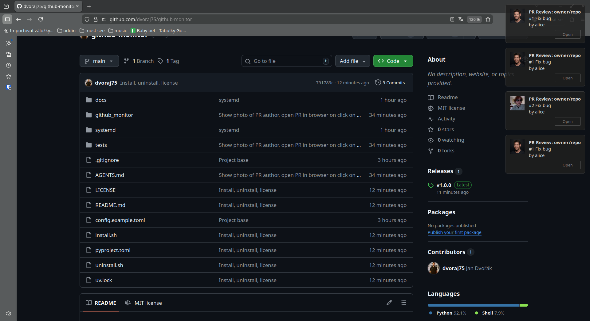

# github-monitor

     

A Python daemon that polls GitHub for pull requests assigned to you (as reviewer
or assignee), holds state in memory, exposes it over D-Bus, and sends desktop
notifications when new PRs arrive.

## Features

- **Live PR monitoring** -- polls GitHub Search API for PRs assigned to you or requesting your review
- **Desktop notifications** -- individual notifications for 1-3 new PRs, summary for more; includes author avatars and clickable links
- **D-Bus interface** -- query current PR state, trigger manual refresh, subscribe to change signals
- **Systemd integration** -- runs as a user service with security hardening
- **Resilient** -- exponential backoff, rate limit handling, graceful shutdown via signals (SIGTERM, SIGHUP for config reload)



## Architecture

```
┌──────────────┐         ┌─────────────────┐
│  GitHub API  │◄────────│  Poller         │
│  (REST)      │         │  (asyncio +     │
└──────────────┘         │   aiohttp)      │
                         └────────┬────────┘
                                  │
                                  ▼
                         ┌─────────────────┐
                         │  State Store    │
                         │  (in-memory     │
                         │   dict)         │
                         └───┬─────────┬───┘
                             │         │
                    ┌────────▼──┐  ┌───▼──────────┐
                    │ Notifier  │  │ D-Bus        │
                    │ (notify-  │  │ Interface    │
                    │  send)    │  │              │
                    └───────────┘  └───┬──────────┘
                                      │
                                      ▼
                              D-Bus session bus
                                      │
                              ┌───────▼────────┐
                              │ Future: Panel  │
                              │ Plugin / CLI   │
                              └────────────────┘
```

The poller queries the GitHub Search API on a configurable interval, the state
store computes diffs (new / updated / closed PRs), the notifier sends desktop
notifications for new PRs, and the D-Bus interface lets external tools query
current state.

For a deeper dive, see [docs/architecture.md](docs/architecture.md).

## Quick start

### Prerequisites

- Python 3.13+
- [uv](https://docs.astral.sh/uv/) (recommended) or pip
- `notify-send` (usually part of `libnotify` — for desktop notifications)
- A GitHub personal access token with `repo` scope

### Install

```bash
git clone https://github.com/dvoraj75/github-monitor.git
cd github-monitor
uv sync            # installs runtime + dev dependencies
```

### Configure

Copy the example config and fill in your details:

```bash
mkdir -p ~/.config/github-monitor
cp config.example.toml ~/.config/github-monitor/config.toml
$EDITOR ~/.config/github-monitor/config.toml
```

```toml
github_token    = "ghp_your_personal_access_token"
github_username = "your-github-username"
poll_interval   = 300       # seconds (minimum 30)
repos           = []        # empty = all repos, or ["owner/repo1", "owner/repo2"]
```

The token can also be provided via the `GITHUB_TOKEN` environment variable,
which takes precedence over the config file value.

See [docs/configuration.md](docs/configuration.md) for the full reference.

### Run

```bash
# Direct execution
uv run github-monitor

# Or via python -m
uv run python -m github_monitor
```

Command-line flags:

```bash
# Custom config path
uv run github-monitor -c /path/to/config.toml

# Verbose logging (DEBUG level)
uv run github-monitor -v
```

### Systemd user service (optional)

To run github-monitor as a background service that starts on login:

```bash
# Install the service
mkdir -p ~/.config/systemd/user/
cp systemd/github-monitor.service ~/.config/systemd/user/

# Enable and start
systemctl --user daemon-reload
systemctl --user enable --now github-monitor

# Check logs
journalctl --user -u github-monitor -f
```

See [docs/systemd.md](docs/systemd.md) for the full guide, including token
configuration, security hardening details, and troubleshooting.

## Project structure

```
github-monitor/
├── config.example.toml          # Example configuration file
├── pyproject.toml               # Project metadata, deps, tool config
├── plan.md                      # Architecture design document
├── implementation.md            # Step-by-step implementation guide
│
├── github_monitor/
│   ├── __init__.py              # Package marker (__version__)
│   ├── __main__.py              # python -m github_monitor entry point
│   ├── config.py                # Configuration loading and validation
│   ├── poller.py                # GitHub API client (search, pagination, rate limits)
│   ├── store.py                 # In-memory state store with diff computation
│   ├── dbus_service.py          # D-Bus interface (methods, signals, bus setup)
│   ├── notifier.py              # Desktop notifications via notify-send
│   └── daemon.py                # Main daemon loop and signal handling
│
├── systemd/
│   └── github-monitor.service   # Systemd user service unit file
│
├── tests/
│   ├── test_config.py           # 17 tests for config module
│   ├── test_poller.py           # 21 tests for poller module
│   ├── test_store.py            # 24 tests for store module
│   ├── test_dbus_service.py     # 28 tests for D-Bus service module
│   ├── test_notifier.py         # 24 tests for notifier module
│   ├── test_daemon.py           # 30 tests for daemon module
│   └── test_main.py             # 7 tests for __main__ module
│
└── docs/                        # Detailed documentation
    ├── architecture.md
    ├── configuration.md
    ├── development.md
    ├── systemd.md
    └── modules/
        ├── config.md
        ├── poller.md
        ├── store.md
        ├── dbus_service.md
        ├── notifier.md
        └── daemon.md
```

## Development

```bash
uv sync                        # install all deps (runtime + dev group)
uv run pytest                  # run tests (ALL passing)
uv run ruff check .            # lint (ALL rules enabled)
uv run ruff format .           # format (black-compatible)
uv run mypy .                  # type check (strict mode)
```

See [docs/development.md](docs/development.md) for coding conventions, tooling
details, and project structure notes.

## Documentation

| Document | Description |
|---|---|
| [docs/architecture.md](docs/architecture.md) | System design, component interactions, design decisions |
| [docs/configuration.md](docs/configuration.md) | Full configuration reference with examples |
| [docs/development.md](docs/development.md) | Developer guide: tooling, conventions, testing |
| [docs/systemd.md](docs/systemd.md) | Systemd user service setup and management |
| [docs/modules/config.md](docs/modules/config.md) | `config.py` API reference |
| [docs/modules/poller.md](docs/modules/poller.md) | `poller.py` API reference |
| [docs/modules/store.md](docs/modules/store.md) | `store.py` API reference |
| [docs/modules/dbus_service.md](docs/modules/dbus_service.md) | `dbus_service.py` API reference |
| [docs/modules/notifier.md](docs/modules/notifier.md) | `notifier.py` API reference |
| [docs/modules/daemon.md](docs/modules/daemon.md) | `daemon.py` API reference |

## Dependencies

| Package | Purpose |
|---|---|
| `aiohttp` | Async HTTP client for GitHub API |
| `dbus-next` | Async D-Bus client/server |
| `tomllib` (stdlib) | TOML config parsing |
| `notify-send` (system) | Desktop notifications |

Dev-only: `pytest`, `pytest-asyncio`, `aioresponses`, `ruff`, `mypy`.

## License

MIT — see [LICENSE](LICENSE) for details.
