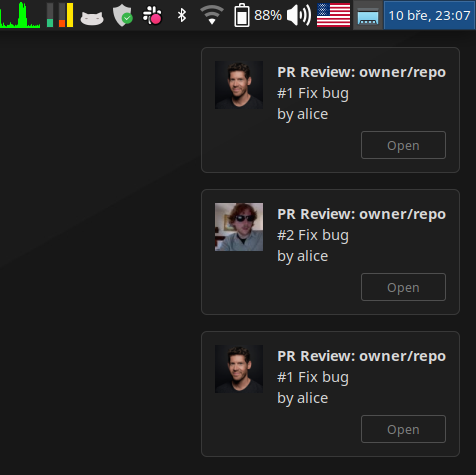
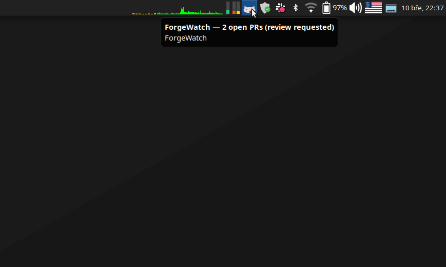
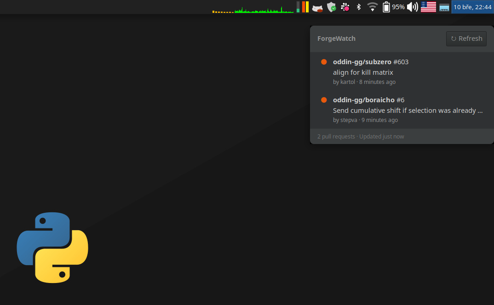
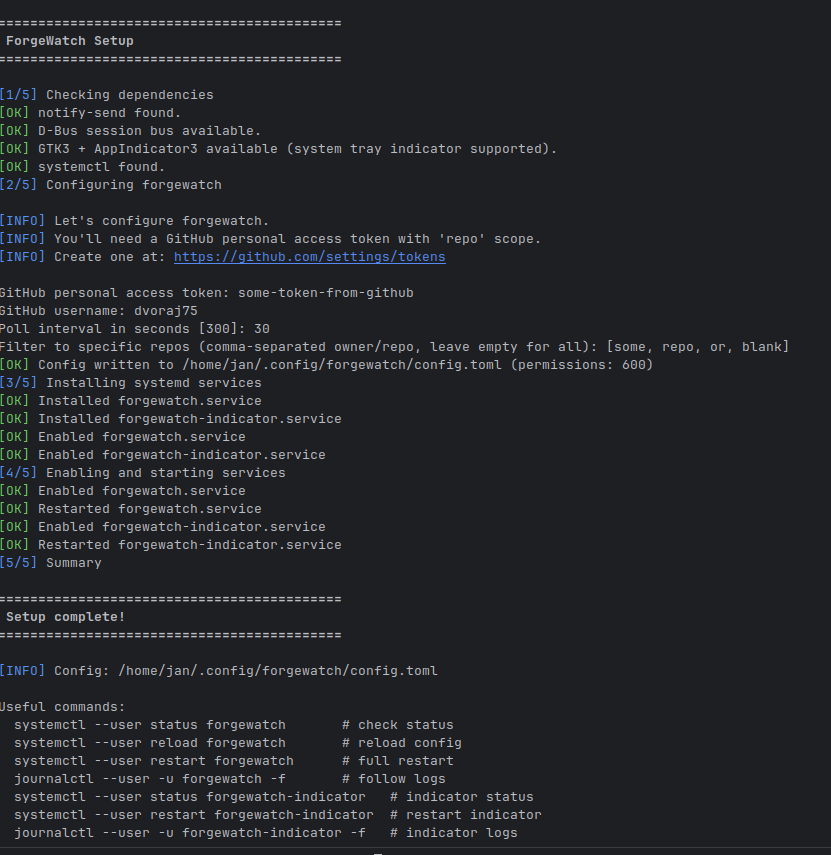

<div align="center">

<!-- PLACEHOLDER: Project logo (recommended ~200px height, transparent background PNG or SVG) -->
<!-- Replace with your logo file when ready -->


# ForgeWatch

**Monitor your GitHub pull requests. Get notified instantly.**

An async Python daemon that watches GitHub for PRs assigned to you,
sends desktop notifications, and shows live status in your system tray.

[](https://github.com/dvoraj75/forgewatch/actions/workflows/ci.yml)
[](https://www.python.org/downloads/)
[](LICENSE)
[](https://docs.astral.sh/ruff/)
[](https://mypy-lang.org/)
[](https://docs.python.org/3/library/asyncio.html)

</div>

---

## Screenshots

<!-- PLACEHOLDER: Replace these with actual screenshots when ready -->

<table>
<tr>
<td width="50%">

**Desktop notifications**

Individual notifications with author avatars and clickable links when new PRs arrive.

<!-- PLACEHOLDER: Screenshot of a desktop notification popup showing PR details -->
<!-- Recommended: ~500px wide, PNG -->


</td>
<td width="50%">

**System tray indicator**

Live PR count in your panel with colour-coded status icons.

<!-- PLACEHOLDER: Screenshot of the system tray area showing the ForgeWatch icon with PR count -->
<!-- Recommended: ~500px wide, PNG, show the tray icon in context of the desktop panel -->


</td>
</tr>
<tr>
<td width="50%">

**PR list popup**

Click the tray icon to see all your PRs at a glance. Click any PR to open it in your browser.

<!-- PLACEHOLDER: Screenshot of the GTK popup window showing a list of pull requests -->
<!-- Recommended: ~500px wide, PNG, show the popup with a few PRs listed -->


</td>
<td width="50%">

**Setup wizard**

Interactive CLI walks you through configuration and systemd service setup.

<!-- PLACEHOLDER: Screenshot of terminal running `forgewatch setup` -->
<!-- Recommended: ~500px wide, PNG, show the coloured terminal output of the setup wizard -->


</td>
</tr>
</table>

---

## Features

- **Live PR monitoring** -- polls the GitHub Search API for PRs assigned to you or requesting your review
- **Desktop notifications** -- individual notifications for small batches with author avatars and clickable links; summary for larger batches
- **System tray indicator** -- optional panel icon with live PR count, colour-coded status, and a popup window listing all PRs
- **D-Bus interface** -- query current PR state, trigger manual refresh, subscribe to change signals
- **GitHub Enterprise support** -- configurable API base URL for GHE instances
- **Systemd integration** -- runs as a user service with security hardening and `systemctl reload` support
- **Resilient** -- exponential backoff with configurable retries, rate limit handling, graceful shutdown (SIGTERM, SIGHUP for config reload)
- **Runtime configurable** -- log level, notification behaviour, D-Bus toggle, and more via config reload without restarting

---

## Installation

### From PyPI

```bash
# Using pip
pip install forgewatch

# Using pipx (recommended for CLI tools)
pipx install forgewatch

# Using uv
uv tool install forgewatch
```

### From source

```bash
git clone https://github.com/dvoraj75/forgewatch.git
cd forgewatch
uv sync            # install runtime + dev dependencies
```

### System packages (for the indicator)

The system tray indicator requires GTK3 and AppIndicator3:

```bash
# Ubuntu / Debian
sudo apt install python3-gi python3-gi-cairo gir1.2-gtk-3.0 \
    gir1.2-appindicator3-0.1 libcairo2-dev libgirepository1.0-dev

# Fedora
sudo dnf install python3-gobject gtk3 libappindicator-gtk3
```

The core daemon works without these -- the indicator is fully optional.

---

## Quick start

### 1. Configure

The fastest way to get started is the setup wizard:

```bash
forgewatch setup
```

Or configure manually:

```bash
mkdir -p ~/.config/forgewatch
cp config.example.toml ~/.config/forgewatch/config.toml
$EDITOR ~/.config/forgewatch/config.toml
```

Minimal config:

```toml
github_token    = "ghp_your_personal_access_token"
github_username = "your-github-username"
poll_interval   = 300       # seconds (minimum 30)
repos           = []        # empty = all repos, or ["owner/repo1", "owner/repo2"]
```

The token can also be provided via the `GITHUB_TOKEN` environment variable.
See [docs/configuration.md](docs/configuration.md) for the full reference.

### 2. Run

```bash
forgewatch                          # start the daemon
forgewatch -v                       # verbose (DEBUG) logging
forgewatch -c /path/to/config.toml  # custom config path
```

### 3. Manage as a systemd service

```bash
forgewatch setup --service-only    # install + enable + start services
forgewatch service status          # check service status
forgewatch service restart         # restart after config changes
```

Or manually:

```bash
cp systemd/forgewatch.service ~/.config/systemd/user/
systemctl --user daemon-reload
systemctl --user enable --now forgewatch
journalctl --user -u forgewatch -f  # follow logs
```

### 4. System tray indicator (optional)

```bash
forgewatch-indicator               # start (daemon must be running)
forgewatch-indicator -v            # verbose logging
```

As a systemd service:

```bash
cp systemd/forgewatch-indicator.service ~/.config/systemd/user/
systemctl --user enable --now forgewatch-indicator
```

See [docs/systemd.md](docs/systemd.md) for the full service management guide.

### CLI commands reference

```bash
forgewatch setup                    # interactive setup wizard
forgewatch setup --config-only      # only create config file
forgewatch setup --service-only     # only install + start services
forgewatch service status           # show service status
forgewatch service start|stop|restart
forgewatch service install          # install systemd unit files
forgewatch service enable|disable   # toggle autostart
forgewatch uninstall                # remove services + optionally config
```

---

## Architecture

```
                         ┌──────────────┐
                         │  GitHub API  │
                         └──────┬───────┘
                                │
                       ┌────────▼────────┐
                       │     Poller      │
                       │  (aiohttp +     │
                       │   asyncio)      │
                       └────────┬────────┘
                                │
                       ┌────────▼────────┐
                       │   State Store   │
                       │   (in-memory)   │
                       └───┬─────────┬───┘
                           │         │
                  ┌────────▼──┐  ┌───▼──────────┐
                  │ Notifier  │  │    D-Bus     │
                  │ (notify-  │  │  Interface   │
                  │  send)    │  └───┬──────────┘
                  └───────────┘      │
                              D-Bus session bus
                                     │
                             ┌───────▼────────┐
                             │   Indicator    │
                             │  (GTK3 tray +  │
                             │   popup window)│
                             └────────────────┘
```

The poller queries the GitHub Search API on a configurable interval. The state
store computes diffs (new / updated / closed PRs). The notifier sends desktop
notifications for new PRs. The D-Bus interface lets the indicator (and other
tools) query current state. The indicator is a separate process that shows a
live tray icon and clickable PR list.

For the full design, see [docs/architecture.md](docs/architecture.md).

---

## Development

```bash
uv sync                        # install all deps
uv run pytest                  # run tests (parallel, with coverage)
uv run ruff check .            # lint (all rules enabled)
uv run ruff format .           # format (black-compatible)
uv run mypy forgewatch         # type check (strict mode)
```

See [docs/development.md](docs/development.md) for coding conventions, testing
patterns, CI pipeline details, and project structure.

---

## Documentation

| Document | Description |
|---|---|
| [Architecture](docs/architecture.md) | System design, component interactions, design decisions |
| [Configuration](docs/configuration.md) | Full configuration reference with examples |
| [Development](docs/development.md) | Developer guide: tooling, conventions, CI pipelines, testing |
| [Systemd](docs/systemd.md) | Service setup, management, and troubleshooting |

### Module API references

| Module | Description |
|---|---|
| [CLI](docs/modules/cli.md) | Management subcommands (setup, service, uninstall) |
| [Config](docs/modules/config.md) | Configuration loading and validation |
| [Poller](docs/modules/poller.md) | GitHub API client, pagination, rate limiting |
| [Store](docs/modules/store.md) | In-memory state store with diff computation |
| [D-Bus Service](docs/modules/dbus_service.md) | D-Bus interface methods, signals, serialization |
| [Notifier](docs/modules/notifier.md) | Desktop notifications, avatars, click-to-open |
| [URL Opener](docs/modules/url_opener.md) | XDG portal + xdg-open URL opener |
| [Daemon](docs/modules/daemon.md) | Main daemon loop and signal handling |
| [Indicator](docs/modules/indicator.md) | System tray icon, popup window, D-Bus client |

---

## Dependencies

**Runtime:**

| Package | Purpose |
|---|---|
| [`aiohttp`](https://docs.aiohttp.org/) | Async HTTP client for GitHub API |
| [`dbus-next`](https://github.com/altdesktop/python-dbus-next) | Async D-Bus client/server |
| [`gbulb`](https://github.com/beeware/gbulb) | GLib/asyncio event loop integration (for the system tray indicator) |

**System tray indicator** (optional, requires system packages):

| Package | Purpose |
|---|---|
| GTK3 + AppIndicator3 | System packages (see [Installation](#system-packages-for-the-indicator)) |

**Dev-only:** pytest, pytest-asyncio, pytest-xdist, pytest-cov, aioresponses,
ruff, mypy, pre-commit, pip-audit.

---

## Contributing

Contributions are welcome! See [CONTRIBUTING.md](.github/CONTRIBUTING.md) for
development setup, coding conventions, testing guidelines, and the PR process.

## License

MIT -- see [LICENSE](LICENSE) for details.
